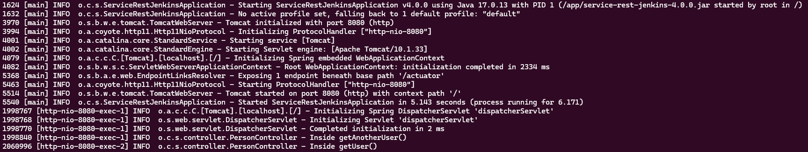
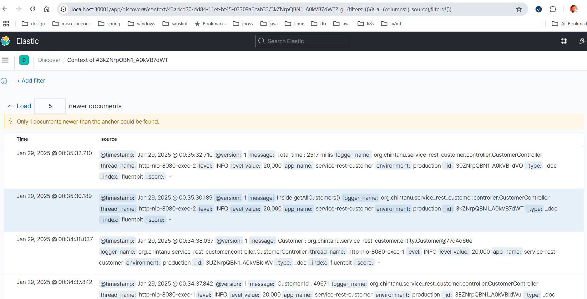
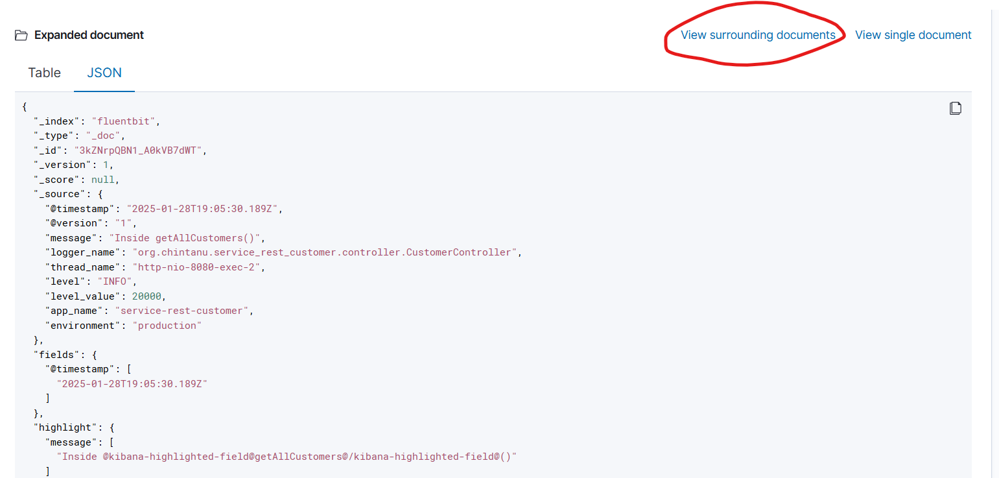

Will do the following in this repo :
- [x] Setup logback
- [x] Check the log file creation inside the container in K8S cluster
   
- [x] Setup sidecar
- [x] Use ELK/EFK to push the logs from the container to the log aggregator
   
- [ ] Setup integration with Kafka(on GCP mostly)